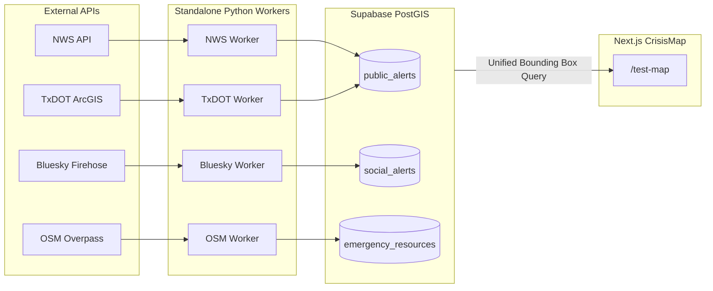

# Lone Star Support: Milestone Plan

## Project purpose

Lone Star Support is a Texas disaster-information platform that combines official weather alerts, road conditions, shelter data, and community reports into a single geospatial picture. The project is being built incrementally: the repository currently includes a working Next.js crisis map and diagnostics app, a Python-based Bluesky ingestion worker, and an offline classroom demo, while the broader platform roadmap continues to expand toward a fully unified Texas disaster dashboard.

## Current implementation baseline

The current repo represents a functional working foundation that is actively evolving toward the end-state production system. It currently includes:

- **Next.js Crisis Map (`/test-map`)**: Interactive MapLibre GL WebGL mapping interface with CARTO light/dark theming, live NWS weather polygons, TxDOT road closure linestrings, an inspection drawer, and a click-to-fly telemetry feed table.
- **Next.js Diagnostics (`/test-feed`)**: Real-time diagnostic tool querying raw NWS and TxDOT APIs against user coordinates.
- **Python Bluesky Worker (`workers/bluesky/`)**: Standalone daemon for Bluesky Jetstream ingestion, disaster filtering, Gemini structured extraction, Photon geocoding, and Supabase PostGIS persistence (`social_alerts` table).
- **Offline Presentation Demo**: Standalone zero-credential demo simulating the ingestion pipeline with fixed fixtures and local SQLite storage.
- **PostGIS Database Schema (`schema.sql`)**: Production schema defining `public_alerts`, `social_alerts`, `emergency_resources`, `community_reports`, and spatial query functions.

---

## Milestone 1: Baseline architecture and working pipeline (Completed)

### Goal

Establish the core data flow, project structure, and social ingestion pipeline without overbuilding before patterns are proven.

### Deliverables & Status

- [x] Next.js app shell and directory structure under `src/app/`.
- [x] Python worker pipeline for Bluesky ingestion, Gemini extraction, and Photon geocoding.
- [x] Local offline demo mode for classroom presentations (`python workers/bluesky/demo.py`).
- [x] Persistent SQLite queue state and location validation safeguards.
- [x] Supabase PostGIS persistence pattern for geotagged social reports (`social_alerts`).

---

## Milestone 3: Unified alert map and frontend dashboard (In Progress)

### Goal

Transition the frontend from a raw diagnostic tool into a slick, responsive geospatial crisis dashboard aggregating multiple emergency layers.

### Phased Roadmap

#### Phases 1–3: Core Map & Telemetry Visualization (Completed)

- [x] **Vector Basemap Theming**: Muted, high-contrast CARTO Dark Matter and Positron vector styles dynamically synced with system/app theme (`next-themes`).
- [x] **Camera Stabilization**: 3D tilt strictly locked (`maxPitch: 0`) for an orthographic 2D top-down view. Compass button resets center, zoom, bearing (`0°`), and pitch (`0°`).
- [x] **Multi-Layer WebGL Rendering**:
  - Live NWS storm warning polygons colored dynamically by urgency (Red = Critical, Orange = Severe, Yellow = Medium).
  - Live TxDOT road closures rendered as high-visibility dashed linestrings.
- [x] **Null-Geometry Preservation**: County-wide watches and regional bulletins without radar polygons (`geometry: null`) are preserved in state and displayed in the inspector.
- [x] **Slide-Out Inspection Drawer**: Responsive panel showing official recommended actions, countdown timers, affected areas, and descriptions.
- [x] **Spatial Community Chatter (Prototyping)**: In-memory Turf.js containment (`@turf/boolean-point-in-polygon`) that filters social reports located inside the clicked hazard polygon.
- [x] **Telemetry Feed Table & Click-to-Fly**: Comprehensive inspector below the map with search, filter tabs, and camera framing using `@turf/bbox`.
- [x] **Component Decoupling**: Separated into modular components (`Map.tsx`, `MapControls.tsx`, `LayerControlDock.tsx`, `HazardDrawer.tsx`, `AlertFeedTable.tsx`).

#### Phase 4: Live Supabase Social Integration (Active Next Step)

- [ ] **Next.js Server Route Handler (`/api/social-alerts`)**: Connect frontend directly to the Supabase `social_alerts` table populated by the Bluesky worker.
- [ ] **Server-Side Revalidation Caching**: Apply 60-second caching on the server to prevent concurrent map viewers from exhausting database query limits.
- [ ] **Freshness Filtering**: Query the last 24 hours of reports by default (`created_at >= NOW() - INTERVAL '24 hours'`), with UI time-filter pills (`6h` / `12h` / `24h`) in the layer dock.
- [ ] **Developer Fallback**: Gracefully fall back to mock fixtures if `SUPABASE_URL` is unconfigured, keeping local development resilient.

#### Phase 5: Critical Infrastructure & Shelters

- [ ] **OpenStreetMap POIs**: Import and visualize designated warming/cooling shelters and hospital triage centers from the `emergency_resources` table.
- [ ] **POI Clustering**: Implement WebGL marker clustering for high-density city shelter points.

---

## Milestone 2: Official data ingestion & backend consolidation (Upcoming)

### Goal

Move official telemetry ingestion out of Next.js client-side proxying into dedicated Python background workers that write directly to Supabase PostGIS, making the entire platform a unified database viewer.

### Architecture Shift

### Worker responsibilities

- **NWS Worker**: Scheduled poller resolving county UGC codes to PostGIS boundary polygons and saving to `public_alerts`.
- **TxDOT Worker**: Scheduled poller ingesting road closures and conditions into `public_alerts`.
- **OSM Worker**: Scheduled batch import of emergency infrastructure into `emergency_resources`.
- **Deduplication & Retention**: Enforce idempotent upserts and automated freshness expiry so expired hazards vanish automatically.
- **Single Source of Truth**: Map frontend queries a unified PostGIS endpoint (`/api/hazards?bbox=...`), enabling true server-side spatial joins (`ST_Contains`, `ST_Intersects`).

---

## Milestone 4: Data quality, resilience, and operational readiness

### Goal

Harden the ingestion workers, database indexes, and map interface for production reliability under severe storm conditions.

### Focus areas

- **Spatial Indexing**: Add GiST indexes on all `geom` columns and connect the PostGIS `get_incidents_in_bbox` stored function on map `moveend`.
- **Worker Backoff & Resilience**: Retries, circuit breakers, and rate-limit safeguards across all external APIs.
- **Geocoding Confidence Rules**: Stricter validation preventing location hallucinations in social chatter.
- **Automated Retention Sweeps**: Background cron jobs cleaning up stale reports older than policy windows.
- **PWA & Low-Bandwidth Caching**: Optimize client bundle and tile caching for degraded cellular networks during disasters.

---

## Target architecture summary

The final architecture conceptually operates as:

- **Frontend**: Next.js App Router providing the MapLibre GL WebGL dashboard, layer controls, and slide-out hazard inspector.
- **Workers**: Standalone Python scripts for each telemetry source (Bluesky, NWS, TxDOT, OSM).
- **Storage**: Supabase PostGIS as the single geospatial source of truth (`public_alerts`, `social_alerts`, `emergency_resources`).
- **AI Extraction**: Gemini-powered structured extraction and Photon geocoding for citizen social reports.
- **Spatial Engine**: PostGIS GiST spatial queries linking community social reports directly to authoritative hazard polygons.
