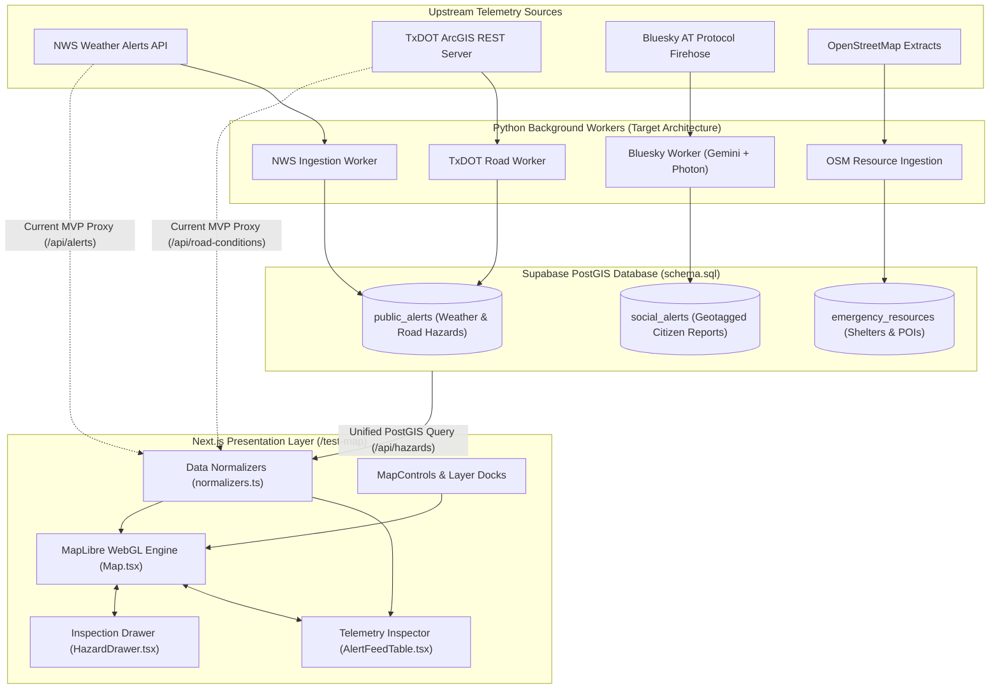
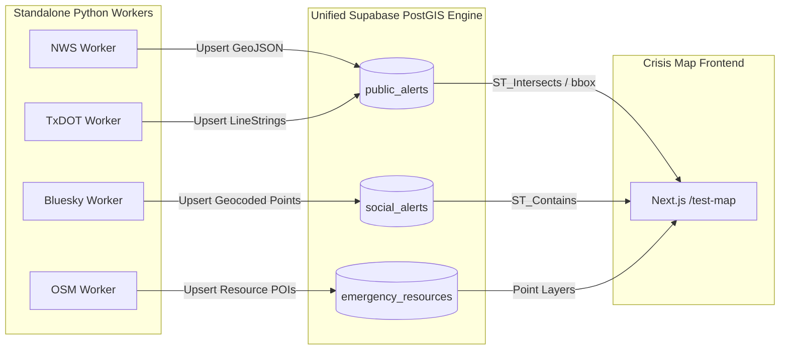

# Lone Star Crisis Map (`/test-map`)

An interactive, high-performance WebGL crisis map and telemetry inspector for **Lone Star Support**, built using Next.js App Router, MapLibre GL, and Tailwind CSS / shadcn/ui.

> [!NOTE]
> **Status: In Progress (Phases 1–3 Complete, Phase 4 In Progress)**  
> This interface represents the active development of Milestone 3 from [ROADMAP.md](../../../ROADMAP.md). It displays live authoritative hazard telemetry (NWS weather polygons and TxDOT road closures) alongside community social reports.

---

## 1. Overview & Architectural Role

The Crisis Map acts as the operational geospatial presentation layer of Lone Star Support. It decouples client-side visualization from data collection by strictly adhering to a **Unified Hazard Contract** mapped to the project's PostgreSQL database schema in [schema.sql](../../../schema.sql).



Whether records are pulled directly through Next.js proxy endpoints today or directly queried from Supabase PostGIS (`public_alerts`, `social_alerts`, `emergency_resources`) in the future, the frontend consumes the exact same data contract without requiring component rewrites.

---

## 2. Current Implementation Status

| Feature / Capability            | Status                  | Implementation Details                                                                                                                       |
| :------------------------------ | :---------------------- | :------------------------------------------------------------------------------------------------------------------------------------------- |
| **Vector Basemap**              | Complete                | Clean CARTO Positron (Light) & Dark Matter vector styles dynamically synced with system/app theme. Zero API keys.                            |
| **Tilt Locking**                | Complete                | Camera pitch is locked to 0° (`maxPitch: 0`, `pitchWithRotate: false`) for an orthographic, top-down 2D view.                                |
| **North / Texas Reset**         | Complete                | Floating compass button smoothly resets viewport center, zoom, bearing (`0°`), and pitch (`0°`).                                             |
| **NWS Weather Warnings**        | Complete                | Live GeoJSON from `/api/alerts`. Polygons rendered via WebGL with data-driven severity styling (Critical, Severe, Medium).                   |
| **TxDOT Road Closures**         | Complete                | Live GeoJSON from `/api/road-conditions`. Rendered as high-visibility dashed linestrings.                                                    |
| **Null-Geometry Preservation**  | Complete                | County-wide watches and regional bulletins without radar polygons (`geometry: null`) are preserved in state and displayed in the feed table. |
| **Slide-Out Inspection Drawer** | Complete                | Glassmorphic panel displaying official instructions, expiration countdown timers, affected areas, and descriptions.                          |
| **Community Chatter (Spatial)** | Complete (Prototyping)  | Tab in the drawer uses `@turf/boolean-point-in-polygon` to spatially filter social reports inside the clicked hazard polygon.                |
| **Telemetry Feed Inspector**    | Complete                | Full-width filterable table below the map with search, count badges, and **Click-to-Fly** navigation.                                        |
| **Live Supabase Social Feed**   | _In Progress (Phase 4)_ | Currently using realistic test fixtures in `data/mockSocialAlerts.ts` until `/api/social-alerts` is connected to Supabase.                   |

---

## 3. Component Architecture

All UI components are modularized to ensure clarity, testability, and separation of concerns:

```
src/app/test-map/
├── page.tsx                       # Dynamic SSR-disabled client entrypoint
├── README.md                      # This documentation
├── data/
│   └── mockSocialAlerts.ts        # Phase 3 testing fixtures for Bluesky social alerts
└── components/
    ├── Map.tsx                    # Core MapLibre controller, viewport, and telemetry loader
    ├── MapControls.tsx            # Top floating dock: Brand badge, ThemeToggle, Refresh, North Reset
    ├── LayerControlDock.tsx       # Bottom-left floating dock: Overlays toggles (NWS, TxDOT, Social)
    ├── MapLayers.ts               # MapLibre WebGL data-driven paint & layout expressions
    ├── HazardDrawer.tsx           # Slide-out inspection sheet with details & community chatter
    └── AlertFeedTable.tsx         # Searchable, filterable telemetry inspector below the map
```

### Shared Supporting Layers

- **Types** ([src/types/hazard.ts](../../types/hazard.ts)): Defines `UnifiedHazard`, `DisasterCategory`, `UrgencyLevel`, and `SocialAlert` matching database enums (`disaster_category`, `urgency_level`).
- **Normalizers** ([src/lib/normalizers.ts](../../lib/normalizers.ts)): Standardizes raw NWS and TxDOT feeds into `UnifiedHazard` instances and generates valid GeoJSON FeatureCollections for MapLibre.
- **Theming** ([src/components/ThemeProvider.tsx](../../components/ThemeProvider.tsx)): Next.js App Router wrapper for `next-themes`, syncing Tailwind v4 variables with MapLibre style URLs.

---

## 4. Key Design Decisions & Safeguards

### A. Handling NWS `geometry: null`

NWS issues two classes of weather bulletins:

1. Convective, radar-tracked storm warnings (Tornadoes, Severe Thunderstorms, Flash Floods) which carry `Polygon` or `MultiPolygon` geometries.
2. Regional / county-wide watches and advisories (Flood Watches, Freeze Warnings, Heat Advisories) which often send `"geometry": null` in the raw GeoJSON, referencing county FIPS/UGC codes instead.

**Our Safeguard:**  
Passing `null` geometries to MapLibre WebGL `<Source>` can trigger silent dropouts or console warnings. `hazardsToGeoJson()` filters strictly for plottable geometries, while `Map.tsx` retains **all** records in state. County-wide bulletins are displayed in [AlertFeedTable.tsx](components/AlertFeedTable.tsx) with a distinct **"County Zone"** badge, and clicking them opens the [HazardDrawer.tsx](components/HazardDrawer.tsx) with full advisory instructions.

### B. Point-in-Polygon Community Chatter

When a user clicks an active storm warning polygon on the map, the drawer's "Community" tab computes spatial containment using `@turf/boolean-point-in-polygon`:

```typescript
const nearbyPosts = socialAlerts.filter((post) =>
  booleanPointInPolygon(post.coordinates, hazard.geometry),
);
```

This fulfills the "Parent-Hazard" model: citizen reports and mutual aid requests from Bluesky are anchored directly to verified government emergency zones.

### C. Orthographic 2D Camera

To avoid disorienting users during an emergency, 3D tilt is strictly locked:

```tsx
<Map
  maxPitch={0}
  minPitch={0}
  pitchWithRotate={false}
  ...
/>
```

Users can pan and zoom freely. If rotated, the **Compass button** in [MapControls.tsx](components/MapControls.tsx) resets both camera rotation (`bearing: 0`) and pitch (`pitch: 0`).

---

## 5. Running the Interface Locally

1. **Install dependencies:**

   ```powershell
   npm install
   ```

2. **Start the Next.js development server:**

   ```powershell
   npm run dev
   ```

3. **Open the map:**
   Navigate to [http://localhost:3000/test-map](http://localhost:3000/test-map).

### What to Verify:

- **Theme Toggle:** Switch between Light and Dark mode; verify the vector basemap smoothly swaps between CARTO Positron and Dark Matter.
- **Live Hazards:** Verify that active weather alerts in Texas render as semi-transparent polygons with colored borders (Red = Critical, Orange = Severe, Yellow = Medium).
- **Inspection Drawer:** Click an alert on the map or click **"Locate on Map"** in the table below. Verify the camera frames the polygon and opens the drawer with instructions.
- **Community Tab:** In the drawer, select the "Community" tab to inspect spatially matched social posts.

---

## 6. Next Steps: Unified Supabase Ingestion Architecture (Phase 4)

While the current MVP proxies NWS and TxDOT feeds directly through Next.js route handlers (`/api/alerts` and `/api/road-conditions`), the long-term target architecture consolidates **all data ingestion into Supabase PostGIS via standalone Python workers**:



### Why Consolidate All Ingestion in Supabase?

1. **True Spatial Joins (`ST_Contains` / `ST_Intersects`):** PostGIS can execute a single query to find all citizen reports and closed highways _geographically inside_ a tornado warning polygon. Client-side spatial math works well for prototyping, but database-level spatial indexing (GiST) scales to tens of thousands of records.
2. **Eliminates Client-Side Rate Limits & Agency Outages:** If the NWS or TxDOT servers suffer transient downtime or rate-limit client IPs, Supabase reliably serves the latest cached snapshot with timestamps.
3. **Automated Expiration & Historical Retention:** Dedicated Python background workers can mark expired alerts, track historical timelines, and archive past disaster trajectories.
4. **Single Frontend Endpoint:** The map connects to a unified route (e.g., `/api/hazards?bbox=...`) that returns all layers formatted to our `UnifiedHazard` contract.
